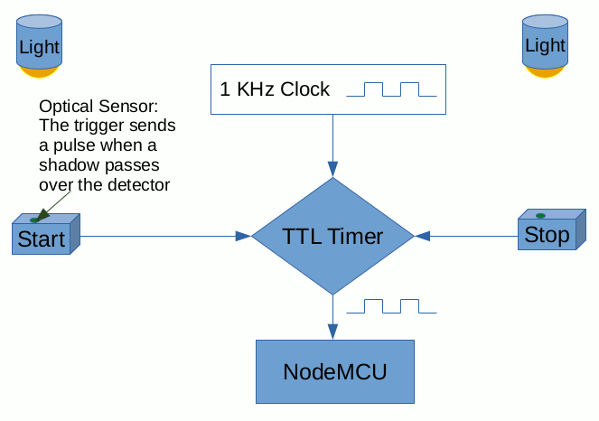

# Pinewood Derby Race Manager

This repository holds some tools I wrote to run a pinewood derby. The software has two primary parts. 

1. Device code for the derby timers.
2. Python code for managing the race.

The library requires [tksheet](https://github.com/ragardner/tksheet).

## Derby TTL Timers

The [device code](NodeMCU_Code/DerbyTimerNodeMCU/DerbyTimerNodeMCU.ino) is written for the [NodeMcu](https://www.nodemcu.com/index_en.html) development kit which is interfaced to a set of custom-built timers. If you are interested in the timer hardware, let me know via E-mail. The timers are Transistor-Transistor Logic (TTL) systems that use optical triggers to clock when the race "starts" and when cars pass the finish line. The TTL systems block/unblock a clock signal from getting to a counter/recorder. For our system, the NodeMcu works as the counter/recorder and sends the results via WiFi to another computer. There is one NodeMcu, and one end trigger per lane on the Pinewood track. The timers can be set up to use one start trigger signal per lane, or to share a single start trigger signal.

The total delay time for the TTL system (optical input change until the trigger pulse blocks/unblocks the clock) is around 850/1600 nanoseconds (typical/max, per part specs). Note that times here are just a straight sum of the typical/max times of the TTL devices and transmission lines. Assuming that the actual delay variance is somewhere around the typical delay, 1 microsecond precision may be realizable if you have a good enough clock / recorder. The default is to use millisecond accuracy. The NodeMCU's internal clock is around 80 MHz, so it is probably fast enough to record at 1 microsecond of precision.

The TTL timer circuits are modular so the number of lanes can be changed within reason. Our track is set up for 4 lanes using 1 start trigger, 4 TTL timers/NodeMCU boards, and 4 stop triggers.

The NodeMCU also communicates with the Race Manager GUI (described below). When a race completes, the NodeMCU sends the pulse count to the Race Manager. Node MCU also allows for the triggers to be reset by a signal from the Race Manager.  

## Python GUI Code

The GUI code is written in Python using Tk. There is a tool for running the race event, a tool for entering scouts into the race and doing weigh-ins, and a tool for editing the race schedule. All tools were developed on Linux. The code is able to auto-generate a race schedule. It attempts to keep racers of similar age on the track at the same time. It makes sure that each racer runs once on each track and averages their scores. 

There are also some testing and debugging tools. This project is still incomplete, but I hope to have a working version together by the end of July 2020.

### Race Manager

The Race Manager is the code that runs on Race Day. It logs the results and lets the Master of Ceremonies (MC) know who to call up.

### Registration

The Registration code should be run in the days (maybe even hours) leading up to the race. This is were we set up all our entries and check to make sure the cars are set up properly.

### Schedule Manager

This Schedule Manager is not written yet. It will let you adjust the auto-generated race schedule.

### Timer Simulation

This is a convenience application for developers. It simulates the timers so that the Race Manager application can run and be tested.

## TODO List

  1. Convert the race log to yaml. <- Skipping for now. I don't see a huge benefit
  2. Improve this README
  3. Create a tool to print the race plan & current stats
  5. Add a GUI interface for adding/editing races.
  6. Add the ability to add championship heats
  7. Add a web interface for scout families to see their progress.
  8. Finally, convert the applications to a web interface
  9. Refactor the messy Race Manager GUI code to better use classes.

